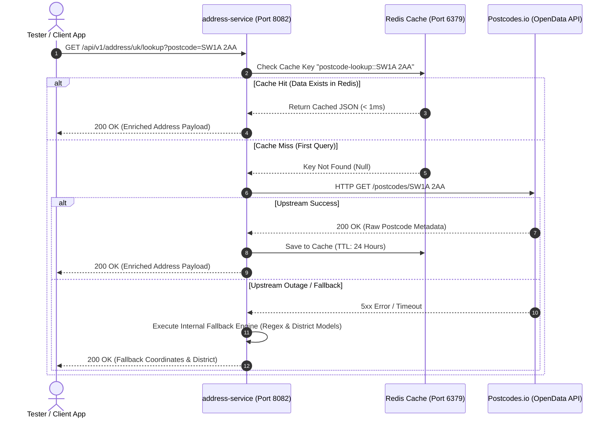
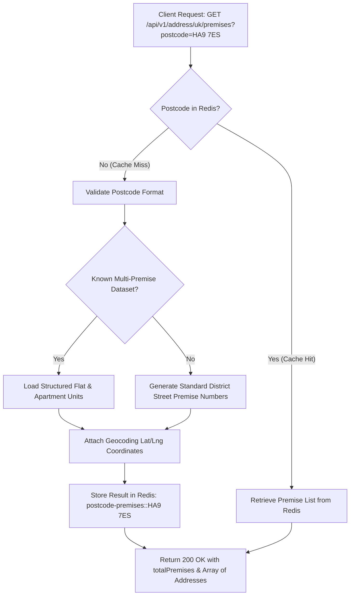
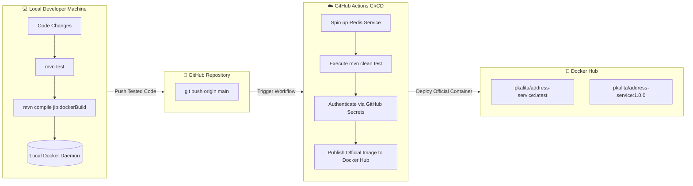

# 📊 UK Address Service - Visual Architecture & Workflow Diagrams

This document contains visual diagrams for testers and developers to understand the internal request flows, caching lifecycle, and CI/CD packaging within **`address-service`**.

---

## 1. Postcode Lookup & Redis Cache Lifecycle

This sequence diagram illustrates how `address-service` handles incoming requests, checks Redis for sub-millisecond responses, and falls back to upstream OpenData or regex models:

---

## 2. Multi-Premise & Flat Resolution Flow (Dropdown Feature)

This flowchart details how building numbers, flat apartments (*e.g., Flat 1 to Flat 8 Bluebell Apartments, HA9 7ES*), and formatted street addresses are resolved for UI dropdowns:

---

## 3. Developer & CI/CD Lifecycle (Maven Jib + GitHub Actions)

This diagram shows how local Maven builds stay private on developer laptops, while official production images are built and published by GitHub Actions:

---

## 📑 Next Reading
- 🏛️ [**Architecture & Service Overview**](./SERVICE_OVERVIEW.md)
- 🧪 [**QA & Tester Guide**](./TESTER_GUIDE.md)
- 🔌 [**Microservice & Frontend Integration Guide**](./INTEGRATION_GUIDE.md)
- ☁️ [**GCP Deployment Guide**](./GCP_DEPLOYMENT.md)
- 🏠 [**Back to Main README**](../README.md)
